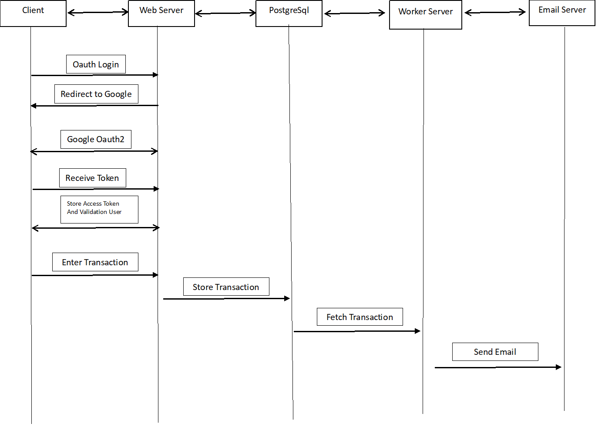

# Project Setup and API Documentation

This document provides instructions on setting up the project, running the server, configuring environment variables, and using the provided APIs. Additionally, it includes a brief system design overview.

## Setup Instructions

## Prerequisites
Before you begin, ensure you have the following software installed on your machine:

- [PHP 8](https://www.php.net/)
- [PostgreSQL 15](https://www.postgresql.org/)
- [Composer](https://getcomposer.org/)

### Run Composer

```bash
Composer install
```

### Database Migrations
Run the following commands to create the necessary database tables:

1. **OAuth Tables:**
   ```bash
   php src/Migrations/CreateOAuthTables.php
   ```

2. **User Tables:**
   ```bash
   php src/Migrations/UserTables.php
   ```

3. **Email Tables:**
   ```bash
   php src/Migrations/EmailTables.php
   ```

Or you can use sh using migration
   ```bash
   sh migration.sh
   ``` 

### Running the Server
Start the PHP built-in server:
```bash
php -S localhost:80 -t public
```

Or start serve.sh
```bash
sh .\serve.sh
```

### Email Worker
To run the email worker via cron, use the following command:
```bash
php src/Workers/EmailWorkers.php
```

### Environment Configuration
Copy the example environment file and fill in the necessary credentials:
```bash
cp .env.example .env
```

Edit the `.env` file with your database and OAuth credentials:
```
DB_HOST=localhost
DB_PORT=5432
DB_DATABASE=YOUR_DATABASE_NAME
DB_USERNAME=YOUR_DATABASE_USERNAME
DB_PASSWORD=YOUR_DATABASE_PASSWORD

OAUTH2_CLIENT_ID=YOUR_GOOGLE_CLIENT_ID
OAUTH2_CLIENT_SECRET=YOUR_GOOGLE_CLIENT_SECRET
OAUTH2_REDIRECT_URI=http://localhost/callback

EMAIL_HOST=sandbox.smtp.mailtrap.io
EMAIL_PORT=587
EMAIL_USERNAME=YOUR_EMAIL_USERNAME
EMAIL_PASSWORD=YOUR_EMAIL_PASSWORD
EMAIL_FROM=email_api_app@yopmail.com
EMAIL_FROM_NAME=Email_API
```

## API Endpoints

### OAuth2

1. **Login:**
   - **URL:** `http://localhost/oauth2`
   - **Method:** `GET`

2. **Callback:**
   - **URL:** `http://localhost/callback`
   - **Method:** `GET`

### Transaction

1. **Get All Transactions:**
   - **URL:** `http://localhost/transaksi`
   - **Method:** `GET`
   - **Authorization:** `Bearer Token`

2. **Get Transaction by ID:**
   - **URL:** `http://localhost/transaksi/:id`
   - **Method:** `GET`
   - **Authorization:** `Bearer Token`

3. **Create Transaction:**
   - **URL:** `http://localhost/transaksi`
   - **Method:** `POST`
   - **Authorization:** `Bearer Token`
   - **Body:**
     ```json
     {
         "nama_barang": "detergent",
         "qty": 4,
         "harga": 455
     }
     ```

4. **Delete Transaction:**
   - **URL:** `http://localhost/transaksi/:id`
   - **Method:** `DELETE`
   - **Authorization:** `Bearer Token`

## System Design

Below is a brief overview of the system design, showing the interactions between various components of the system:


This setup and API documentation should help you get started with the project, run the necessary components, and understand the API structure and system design.
